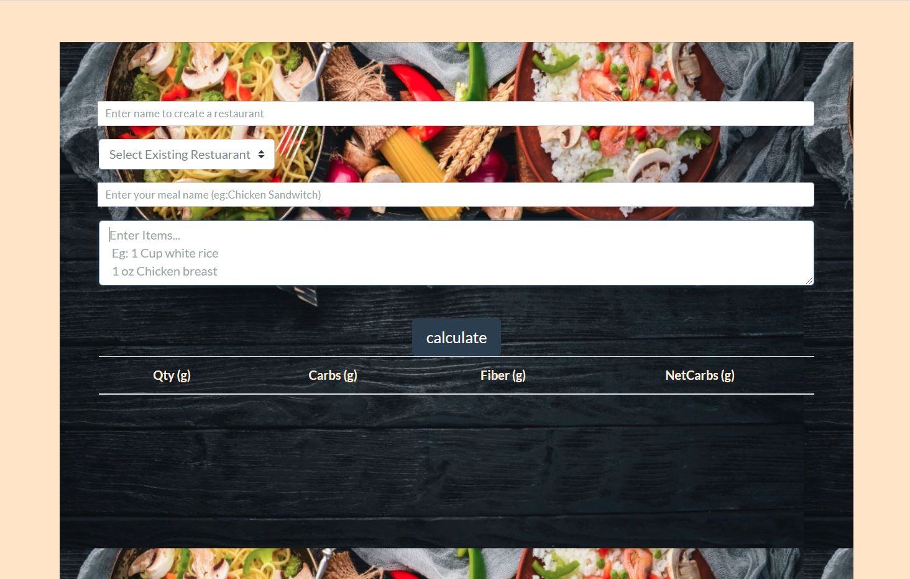

#### AppCarbTracker 

**Overview**
    AppCarbTracker is an application which allows individuals with diatery restrictions to keep track of the amount of carbohydrates in a particular meal.This application was initially developed to help diabetic people but can be used by anybody.

***
 

>##### API 
>Edamam API 

**Languages and Tools:**

  
  
  
  

  

